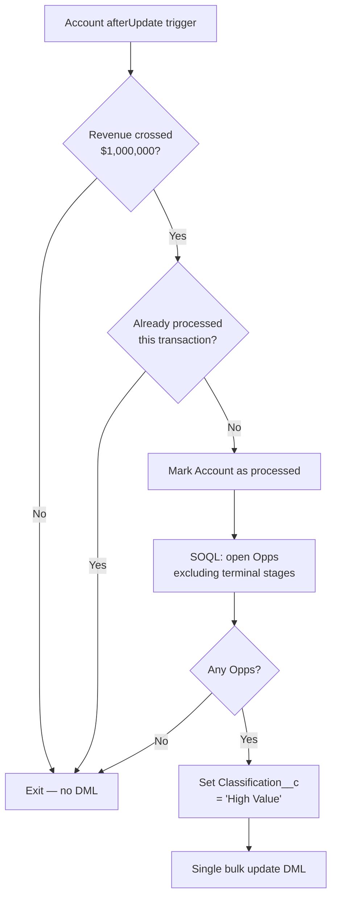

# Scenario 04 – High-Value Opportunity Reclassification

**Difficulty:** Intermediate  
**Category:** Apex / Trigger Framework  
**Objects touched:** Account, Opportunity  
**Custom metadata deployed:** `Opportunity.Classification__c` (Picklist)

---

## Business Context

Sales Operations needs an automated way to flag revenue-significant accounts.
When an Account's **Annual Revenue crosses $1,000,000**, every open Opportunity
linked to that Account must be automatically stamped as **"High Value"** so
that Sales reps, dashboards, and downstream automation can prioritise them
without manual effort.

---

## Requirements

| # | Requirement |
|---|---|
| R1 | Trigger fires on Account `after update`. |
| R2 | Compare old vs new `AnnualRevenue` to detect the crossing event. |
| R3 | Stamp `Classification__c = 'High Value'` on all related open Opportunities. |
| R4 | Exclude terminal-stage Opportunities: **Closed Won**, **Closed Lost**, **Cancelled**. |
| R5 | Support bulk Account updates without hitting governor limits. |
| R6 | Prevent recursive or duplicate Opportunity updates within the same transaction. |

---

## Acceptance Criteria

1. If `AnnualRevenue` remains below `$1,000,000` after update → no Opportunity is reclassified.
2. If `AnnualRevenue` transitions from `< $1,000,000` (or `null`) to `>= $1,000,000` → all related open Opportunities get `Classification__c = 'High Value'`.
3. In a bulk update of N Accounts, only Opportunities belonging to crossing Accounts are updated.
4. Opportunities in terminal stages (`Closed Won`, `Closed Lost`, `Cancelled`) are never reclassified.
5. If the same Account is saved multiple times in the same transaction, Opportunity DML fires only once per Account.

---

## Pre-Deployment Steps

### 1 — Custom field: `Opportunity.Classification__c`

The field metadata is included in the repo and is deployed automatically.

```
Object  : Opportunity
API Name: Classification__c
Type    : Picklist
Values  : Standard (default), High Value, Strategic
```

This is the only manual prerequisite — it is handled by the SFDX deploy.

---

## Salesforce Artifacts

| Artifact | Type | API Name / Path |
|---|---|---|
| Account trigger | ApexTrigger | `AccountTrigger` |
| Handler class | ApexClass | `AccountTriggerHandler` |
| Service class | ApexClass | `AccountHighValueService` |
| Test class | ApexClass | `AccountTriggerTest` |
| Custom field | CustomField | `Opportunity.Classification__c` |
| Test factory | ApexClass | `TestDataFactory` (extended with Account/Opp builders) |

---

## Implementation Details

### Architecture

```
AccountTrigger (after update)
  └─ TriggerDispatcher.run()
       └─ AccountTriggerHandler.afterUpdate()
            └─ AccountHighValueService.reclassifyOpportunities()
```

The framework keeps one trigger per object with zero logic inside it.
All business rules live in `AccountHighValueService`, a `with sharing` class
that is testable in isolation without a trigger context.

### Key Design Decisions

#### 1. Threshold crossing detection (old vs new)

```apex
Boolean wasBelow   = oldAcc.AnnualRevenue == null || oldAcc.AnnualRevenue < 1000000;
Boolean isAtOrAbove = acc.AnnualRevenue != null   && acc.AnnualRevenue >= 1000000;

if (wasBelow && isAtOrAbove) { crossingIds.add(acc.Id); }
```

Checking **both sides** means:
- Accounts that were already ≥ $1M and get re-saved are silently skipped.
- Only the exact crossing event triggers the DML — no unnecessary Opportunity updates on steady-state saves.

**Interview angle:** "Why not just check `acc.AnnualRevenue >= 1000000`?"  
→ Because that fires on every save once revenue is high, updating Opportunities that are already classified and burning unnecessary DML.

#### 2. Terminal-stage filtering in SOQL

```apex
WHERE AccountId IN :crossingIds
AND   StageName NOT IN :TERMINAL_STAGES
AND   IsClosed = FALSE
```

Filtering in SOQL keeps the result-set small. If 500 Opps exist per Account
but 400 are closed, pulling all 500 into Apex heap and filtering in a loop
would be wasteful and risks the 50,000-row limit.

`IsClosed = FALSE` is belt-and-suspenders: Salesforce sets this system field
automatically for `Closed Won` / `Closed Lost`, so even if someone adds a new
terminal stage to the picklist without updating `TERMINAL_STAGES`, closed Opps
still can't slip through.

#### 3. Static `Set<Id>` recursion guard

```apex
private static Set<Id> processed = new Set<Id>();
```

A static variable persists for the lifetime of the transaction. If any Flow,
Process Builder, or other Apex class re-saves the same Account within the same
execution context, `reclassifyOpportunities` silently exits for already-handled
Accounts. The set is populated **before** the DML call to handle re-entrant
invocations that fire mid-update.

#### 4. Single bulk DML call

All qualifying Opportunities across every crossing Account are collected in one
list and passed to a single `update` statement. This consumes exactly 1 DML
statement regardless of how many Accounts or Opportunities are involved.

---

## Testing Strategy

| Test method | Criterion covered |
|---|---|
| `revenueStaysBelowThreshold_noReclassification` | Revenue stays below → no update |
| `revenueCrossesAtThreshold_oppReclassified` | Crosses at exactly $1M |
| `revenueCrossesAboveThreshold_oppReclassified` | Crosses above $1M |
| `revenueFromNullToAboveThreshold_oppReclassified` | Null → above threshold |
| `revenueAlreadyAboveThreshold_noRedundantUpdate` | Already above → no second update |
| `bulkUpdate_onlyCrossingAccountsReclassified` | 200 Accounts — only crossing subset updated |
| `terminalStageOpps_notReclassified` | Closed Won / Closed Lost / Cancelled excluded |
| `recursionGuard_noDoubleUpdate` | Same Account saved twice → no duplicate DML |
| `noRelatedOpps_noException` | Account with zero Opps → no exception |
| `handlerEmptyContexts_noException` | Handler stubs for unused trigger events |

All tests use `TestDataFactory` — no inline SObject construction.  
`@TestVisible` on the `processed` set allows tests to verify guard state without
making it a public API.

**Coverage achieved:**

| Class | Coverage |
|---|---|
| `AccountHighValueService` | 100% |
| `AccountTrigger` | 100% |
| `AccountTriggerHandler` | 100% |

---

## Governor Limit Analysis

| Resource | Usage pattern |
|---|---|
| SOQL queries | 1 query (Opportunities) regardless of batch size |
| DML statements | 1 `update` (all Opportunities in one call) |
| Heap | Proportional to open Opp count; terminal stages filtered in DB |
| CPU | O(n) loop over accounts + O(m) loop over qualifying Opps |

Safe for Batch Apex (200-record chunks) and Data Loader bulk operations.

---

## Diagram (Mermaid)



---

## README Highlights

- **Framework pattern**: one trigger → dispatcher → handler → service; completely decoupled.
- **Threshold crossing logic**: demonstrates correct old/new field comparison — a common interview question.
- **Recursion guard**: static Set pattern, the idiomatic Salesforce solution.
- **SOQL vs Apex filtering trade-off**: explicitly documented with governor limit reasoning.
- **Test coverage**: 10 test methods, each targeting a single acceptance criterion.
