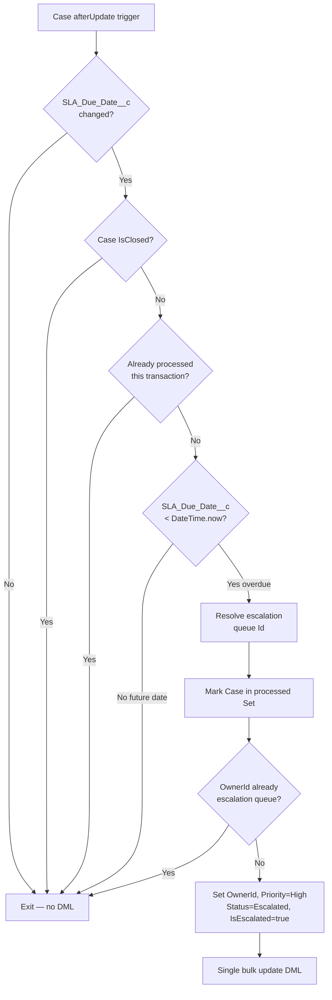

# Scenario 05 – Case SLA Escalation

**Difficulty:** Intermediate  
**Category:** Apex / Trigger Framework / Queues  
**Objects touched:** Case  
**Custom metadata deployed:** `Case.SLA_Due_Date__c` (DateTime), `Case_Escalation_Queue` (Queue)

---

## Business Context

Support teams operate under strict SLA commitments. When a Case SLA due date is
updated and the deadline has already passed, the Case must be automatically
escalated — reassigned to a dedicated **Case Escalation Queue**, with Priority
raised to **High** and Status set to **Escalated** — so that senior agents can
intervene before the breach affects customer satisfaction scores.

---

## Requirements

| # | Requirement |
|---|---|
| R1 | Trigger fires on Case `after update`. |
| R2 | Detect changes to `SLA_Due_Date__c` (old vs new comparison). |
| R3 | If new `SLA_Due_Date__c` is in the past → reassign Case to escalation queue, set Priority=High, Status=Escalated, IsEscalated=true. |
| R4 | If new `SLA_Due_Date__c` is in the future (SLA extended) → no action. |
| R5 | If Case is already in the escalation queue → skip, no duplicate reassignment. |
| R6 | Closed Cases must never be escalated. |
| R7 | Support bulk Case updates without governor limit violations. |
| R8 | Prevent recursive processing when the service's DML fires the trigger again. |

---

## Acceptance Criteria

1. SLA date extended to a future date → Case stays in its current queue, Status unchanged.
2. SLA date set to a past date → Case is reassigned to `Case Escalation Queue`, Priority=High, Status=Escalated, IsEscalated=true.
3. Case already owned by the escalation queue → OwnerId unchanged on subsequent SLA updates.
4. Bulk update of N Cases → only the overdue subset is escalated.
5. Closed Cases (IsClosed=true) → never escalated.
6. Within a single transaction, the same Case must not be processed more than once.

---

## Pre-Deployment Steps

Both prerequisites are included in the repo and deployed automatically.

### 1 — Custom field: `Case.SLA_Due_Date__c`

```
Object  : Case
API Name: SLA_Due_Date__c
Type    : DateTime
Purpose : Records the SLA commitment deadline for the Case.
          When updated, the trigger checks if this date is in the past.
```

### 2 — Queue: `Case_Escalation_Queue`

```
Developer Name : Case_Escalation_Queue
Label          : Case Escalation Queue
Supported Obj  : Case
File           : force-app/main/default/queues/Case_Escalation_Queue.queue-meta.xml
```

The queue requires no members to be pre-configured ��� Cases are assigned to it
as a pool; team members subscribe via queue membership in Setup.

> **Note on test isolation:** Salesforce's `@IsTest(SeeAllData=false)` context
> cannot see org-deployed queues. Tests create their own Group with a distinct
> `DeveloperName` (`Test_Case_Escl_Queue`) and inject it into the service via
> the `@TestVisible escalationQueueDevName` static variable. This avoids
> `DUPLICATE_DEVELOPER_NAME` errors while keeping the service's production
> configuration unchanged.

---

## Salesforce Artifacts

| Artifact | Type | API Name / Path |
|---|---|---|
| Case trigger | ApexTrigger | `CaseTrigger` |
| Handler class | ApexClass | `CaseTriggerHandler` |
| Service class | ApexClass | `CaseSLAEscalationService` |
| Test class | ApexClass | `CaseSLAEscalationServiceTest` |
| SLA due date field | CustomField | `Case.SLA_Due_Date__c` |
| Escalation queue | Queue | `Case_Escalation_Queue` |
| Test factory | ApexClass | `TestDataFactory` (extended with `buildCase`, `createCase`) |

---

## Implementation Details

### Architecture

```
CaseTrigger (after update)
  └─ TriggerDispatcher.run()
       └─ CaseTriggerHandler.afterUpdate()
            └─ CaseSLAEscalationService.escalateOverdueCases()
```

### Key Design Decisions

#### 1. Change detection (old vs new `SLA_Due_Date__c`)

```apex
if (c.SLA_Due_Date__c == oldCase.SLA_Due_Date__c) { continue; }
```

Only acts on updates where the field actually changed. This prevents the
service from triggering on every Case save where the due date is already
overdue — avoiding redundant DML on steady-state updates.

**Interview angle:** "Why not just check `c.SLA_Due_Date__c < DateTime.now()`?"  
→ That would re-escalate Cases on every subsequent save, producing duplicate
DML and potentially causing OwnerId ping-pong between the current queue and
the escalation queue.

#### 2. Lazy queue Id resolution with transaction-level caching

```apex
if (transactionQueueId == null) {
    List<Group> queues = [SELECT Id FROM Group WHERE DeveloperName = :escalationQueueDevName LIMIT 1];
    transactionQueueId = queues[0].Id;
}
```

The queue SOQL fires at most once per transaction, regardless of how many
Cases are in the trigger batch. Querying the queue inside a loop would burn
one SOQL per Case and hit the 100-query governor limit on a batch of 101+ Cases.

`DeveloperName` is used (not `Name`) because labels can be renamed by admins
without changing the code.

#### 3. Static `Set<Id>` recursion guard

```apex
private static Set<Id> processed = new Set<Id>();
```

When `update toUpdate` fires inside the service, `CaseTrigger` fires again
for the same Case Ids. The guard detects those Ids in `processed` and exits
immediately, preventing an infinite DML loop.

The set is populated **before** the DML to handle re-entrant trigger stacks
where the inner DML fires the trigger before the outer DML returns.

#### 4. Closed Case guard via `IsClosed`

```apex
if (c.IsClosed) { continue; }
```

`IsClosed` is a system-maintained boolean that Salesforce sets to `true` for
`Closed` status. Using it instead of `Status == 'Closed'` means new terminal
statuses added to the picklist are automatically excluded without code changes.

#### 5. `@TestVisible` injectable queue dev name

```apex
@TestVisible
private static String escalationQueueDevName = 'Case_Escalation_Queue';
```

Making this a mutable static (not `final`) allows test classes to inject a
test-specific queue developer name. This resolves the `DUPLICATE_DEVELOPER_NAME`
conflict that would occur if tests tried to insert a Group with the same
developer name as the metadata-deployed queue.

---

## Testing Strategy

| Test method | Criterion |
|---|---|
| `slaExtendedToFuture_noEscalation` | AC1: future date → no escalation |
| `slaOverdue_caseEscalated` | AC2: past date → escalated, all fields set |
| `caseAlreadyInEscalationQueue_notReassigned` | AC3: already in queue → no change |
| `bulkUpdate_onlyOverdueCasesEscalated` | AC4: 200 Cases, only overdue half escalated |
| `closedCase_notEscalated` | AC5: IsClosed=true → no DML |
| `recursionGuard_noDoubleUpdate` | AC6: second save in same transaction → guard fires |
| `slaFieldUnchanged_noEscalation` | Edge: non-SLA field change → no escalation |
| `slaClearedToNull_noEscalation` | Edge: SLA cleared → no escalation |
| `handlerEmptyContexts_noException` | Coverage: unused handler stubs |

**Coverage achieved:**

| Class | Coverage |
|---|---|
| `CaseSLAEscalationService` | 97% |
| `CaseTrigger` | 100% |
| `CaseTriggerHandler` | 100% |

---

## Governor Limit Analysis

| Resource | Pattern |
|---|---|
| SOQL queries | 1 (queue lookup, cached after first call) |
| DML statements | 1 `update` for all qualifying Cases |
| Heap | O(n) over trigger batch — no nested collections |
| CPU | O(n) double-pass (candidate collection + DML list build) |

Safe for Batch Apex (200-record chunks), Data Loader, and Flows that bulk-update Cases.

---

## Diagram (Mermaid)



---

## README Highlights

- **Queue as a deployment artifact**: demonstrates how to include a Queue in SFDX source control using the `Queue` metadata type — common interview question.
- **DateTime-based SLA logic**: real-world pattern for SLA breach detection using `DateTime.now()` comparison.
- **Test isolation challenge**: `@TestVisible` injection pattern to decouple tests from org-deployed setup data.
- **Defensive `IsClosed` check**: shows awareness of Salesforce system fields vs picklist-value checks.
- **Transaction-level cache**: lazy `transactionQueueId` is a governor-limit pattern taught at architect level.
